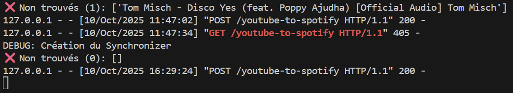

# BeatSync App - Synchronisation de Playlists YouTube vers Spotify

  

## Description

Ce projet est une application **Python** / **Flask, React** / **Vite** et **MongoDB** qui permet de synchroniser les vidéos d'une playlist YouTube
en créant automatiquement une playlist correspondante sur Spotify.

L'objectif principal est de se familiariser avec :

- l'utilisation d'APIs REST (YouTube et Spotify),
- l'authentification OAuth,
- la gestion de données JSON,
- la structuration d'un projet en architecture MVC (Models, Controller, Views),
- la recherche intelligente de morceaux sur Spotify avec correspondance titre/artiste.
- la création d'une interface web en React.

## Fonctionnalités

- Extraire les titres et artistes d'une playlist YouTube
- Créer une nouvelle playlist sur Spotify
- Rechercher les morceaux sur Spotify avec un score de correspondance
- Ajouter les morceaux trouvés à la playlist Spotify
- Interface web avec connexion Spotify sécurisée, saisie d’URL YouTube, et suivi de la synchronisation

## Technologies principales

- **Backend :** Python, Flask, Spotipy, Google API Client
- **Frontend :** React (JS, Vite)
- **BDD :** MongoDB
- **Tests :** Pytest, Postman
- **CI/CD :** GitHub Actions
- **Gestion de projet :** Trello, Figma

## Architecture du projet

Ce projet suit une architecture MVC adaptée avec un frontend React et un backend Flask :

- **Models** : youtube_model.py et spotify_model.py côté backend, qui représentent les données et la logique métier (extraction YouTube, création playlist Spotify).
- **Controllers** : les routes Flask (sync_controller) orchestrent les appels aux models et renvoient les données sous forme JSON.
- **Views** : côté frontend React, les pages et composants (Login, Dashboard, Footer, etc.) affichent l’interface utilisateur.

Note : Dans cette architecture, Flask ne rend plus de HTML. Les “views” sont entièrement gérées par React, ce qui correspond à une séparation frontend/backend tout en conservant le principe MVC.

## Prérequis

- Python 3.9 ou supérieur
- Un compte Spotify avec une application enregistrée pour obtenir Client ID et Client Secret
- Une clé API YouTube
- Modules Python :
  - `spotipy`
  - `python-dotenv`
  - `google-api-python-client` (pour YouTube)
  - `flask`
- Modules React :
  - `npm create vite@latest youtube-to-spotify-front --template react`
  - `npm install`

## Installation

1. Cloner le projet :
   `git clone <URL_DU_REPO>`
2. Créer un environnement virtuel et l'activer :

   - `python -m venv venv`
   - `source venv/bin/activate`   # Linux/Mac
   - `.\venv\Scripts\activate`    # Windows
3. Installer les dépendances :

   - `pip install -r requirements.txt`
   - `pip freeze > requirements.txt` (pour mettre à jour les dépendances)
4. Créer un fichier `.env.local` (voir fichier .env) avec :

   - SPOTIFY_CLIENT_ID=...
   - SPOTIFY_CLIENT_SECRET=...
   - SPOTIFY_REDIRECT_URI=...
   - SPOTIFY_USER_ID=...
   - YOUTUBE_API_KEY=...
   - FLASK_SECRET_KEY=
   - MONGO_URI=
   - FRONTEND_URL=

## Utilisation

- Backend :

1. Se positionner à la racine du projet :
   `python backend/app.py`
2. Entrer l'URL de la playlist YouTube quand demandé
3. L'application créera la playlist sur Spotify et ajoutera les morceaux trouvés

- Frontend :

1. Se positionner dans le dossier `frontend` :
   `npm run dev`
2. Ouvrir l'URL `http://127.0.0.1:5173/` dans le navigateur

## Points importants

- Certains morceaux peuvent ne pas être trouvés si le nom ou l'artiste est trop différent
- Les vidéos YouTube provenant de chaînes "Topic" ou dont le titre est peu clair peuvent parfois ne pas être parfaitement reconnues par Spotify.
- L’API YouTube peut renvoyer des vidéos "fantômes" (supprimées, privées ou non listées)
  si elles sont encore référencées dans la playlist. Ces vidéos peuvent ne plus apparaître dans l’interface YouTube, mais être comptées dans la requête API. Elles peuvent provoquer des écarts dans le nombre de morceaux importés.
- La synchronisation inverse pourrait également être envisageable : à partir d'une playlist Spotify, nous pouvons récupérer les vidéos YouTube correspondantes et les ajouter à une playlist YouTube. Cela nécessite d'obtenir l'autorisation OAuth via l'API YouTube.
- La connexion OAuth Spotify est opérationnelle : le front redirige correctement vers Spotify et revient sur le dashboard une fois l’autorisation validée.
- Stockage des tokens dans MongoDB pour renforcer la sécurité et permettre une authentification plus fiable.

## Fonctionnalités à venir

Ces fonctionnalités sont prévues pour les prochaines versions afin d’améliorer la sécurité et l’expérience utilisateur :

- Amélioration de la gestion des erreurs et de la correspondance entre les morceaux YouTube ↔ Spotify

## Déploiement prévu

Le déploiement sera prochainement effectué :

- sur **Render**, pour héberger le backend Flask et le frontend React, accessible via une URL publique
- en **complément avec Docker**, pour créer un conteneur isolé contenant l’application complète et toutes ses dépendances, facilitant le test et la portabilité sur d’autres environnements

Les instructions détaillées de déploiement (Dockerfile, configuration Render, etc.) seront ajoutées après la finalisation de ces fonctionnalités.

## Organisation du projet

- Cahier des charges : [PDF](https://github.com/RukenDogan/youtube_to_spotify/tree/main/docs-images/CAHIER_DES_CHARGES_BeatSyncApp.pdf)
- Gestion de projet (méthode Kanban) : [lien Trello]([https://trello.com/invite/b/68e4cd834914b08442301ac4/ATTI16bcee34f742fc93b408b9e6ff2bba5e6B03E2A1/gestion-de-projet-youtube-spotify])
- Création de maquettes avec Figma pour les pages Login et Dashboard : [lien Figma]([https://www.figma.com/design/NAmYPrvKnnxLt6XkuWXm5A/Pages-Login-et-Dashboard-youtube-spotify?node-id=0-1&p=f&t=DaXgRIgKQMHaadRD-0])

## Tests

- **Tests automatisés (CI/CD)** : exécutés avec GitHub Actions à chaque commit/pull request
- **Tests unitaires** : avec `pytest` dans le dossier `backend/tests`
- **Tests manuels** :

  - via **Postman** pour tester les endpoints
  - via le **terminal**
- Test de la route avec Postman :

 

- Test de la route dans le terminal :

 

## Sécurité

- Les clés API et identifiants Spotify sont stockés dans un fichier `.env.local` non versionné.
- (plus tard) Le projet ne stocke pas les tokens d’accès Spotify, ils sont utilisés uniquement le temps de la session.
- (plus tard) Aucune donnée utilisateur n’est conservée côté serveur.

## Aperçu visuel

**Côté backend**

- Lancement du script `main.py` :
  Exemple d’exécution dans le terminal lors de la synchronisation :

  

Résultat sur Spotify :
Playlist créée automatiquement :

  

**Côté frontend (React)**

- Se placer dans le dossier `frontend` et lancer `npm run dev` :

**Page de connexion** **(Login)** :
Page d’accueil invitant l’utilisateur à se connecter à son compte Spotify :

  

**Page Dashboard** :
Interface principale pour synchroniser les playlists YouTube → Spotify :

  

**Page NotFound** :
Gère les erreurs de connexion ou les routes inexistantes :

  

**Page AlreadyConnected :**
Page de redirection qui s'affiche si l'utilisateur est déjà connecté à Spotify.
Elle apparaît lorsqu’un utilisateur clique sur **“Se connecter à Spotify”** depuis la page Login alors que sa session OAuth est toujours active.
Cette page sert de transition avant de rediriger automatiquement l’utilisateur vers le  **Dashboard** , évitant ainsi de refaire une authentification inutile :

  

* **Flux utilisateur simplifié :**
  `Login → (OAuth Spotify / AlreadyConnected selon session) → Dashboard`
* Permet d’améliorer l’expérience utilisateur en évitant de demander une nouvelle autorisation si l’utilisateur est déjà connecté.

**Page Privacy :**
Cette page informe l’utilisateur sur la gestion de ses données personnelles et sur la manière dont BeatSync utilise les informations de Spotify et YouTube :

  

  

#### Gif Visuel :

  

---

### Source images :

- **Image de fond** : [Vecteezy – Vinyle classique
  ](https://es.vecteezy.com/png/49662375-clasico-vinilo-grabar-dto-textura)--> Image d’origine téléchargée sur Vecteezy, **découpée et ajustée** pour n’en conserver qu’une partie.
- **Logo BeatSync** : réalisé à partir d’un modèle Canva, avec modifications personnelles (couleurs, texte, ajout de flèches)
- **Icône de cœur battant** (Dashboard) : composition d’éléments Canva (couleurs modifiées)

  Les modifications graphiques (découpe, transparence, GIF) ont été réalisées avec des outils en ligne.

---

Projet réalisé par Ruken Dogan
