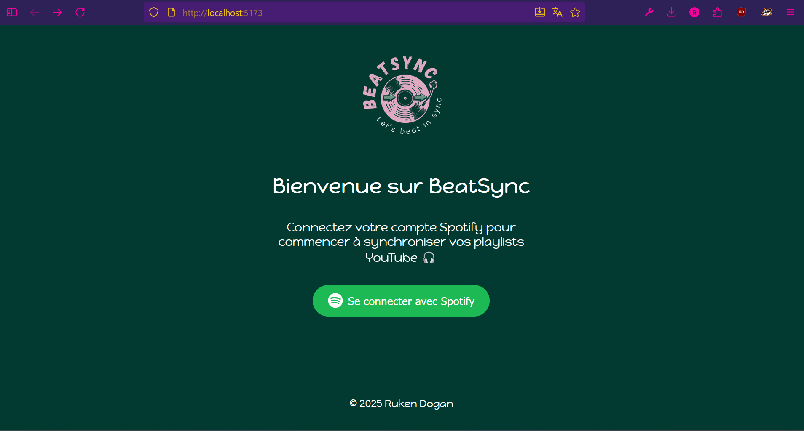
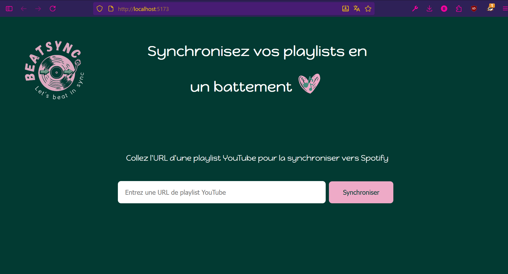

# Synchronisation de Playlists YouTube vers Spotify - BeatSyncApp

## Description
Ce projet est une application **Python** et **React** qui permet de synchroniser les vidéos d'une playlist YouTube
en créant automatiquement une playlist correspondante sur Spotify.

L'objectif principal est de se familiariser avec :
- l'utilisation d'APIs REST (YouTube et Spotify),
- l'authentification OAuth,
- la gestion de données JSON,
- la structuration d'un projet en architecture MVC (Models, Controller, Views),
- la recherche intelligente de morceaux sur Spotify avec correspondance titre/artiste.
- la création d'une interface web en React.

## Fonctionnalités
- Extraire les titres et artistes d'une playlist YouTube
- Créer une nouvelle playlist sur Spotify
- Rechercher les morceaux sur Spotify avec un score de correspondance
- Ajouter les morceaux trouvés à la playlist Spotify
- Interface web avec connexion Spotify sécurisée (à venir), saisie d’URL YouTube, et suivi de la synchronisation

## Prérequis
- Python 3.9 ou supérieur
- Un compte Spotify avec une application enregistrée pour obtenir Client ID et Client Secret
- Une clé API YouTube
- Modules Python :
    - `spotipy`
    - `python-dotenv`
    - `google-api-python-client` (pour YouTube)
    - `flask`
- Modules React :
   - `npm create vite@latest youtube-to-spotify-front --template react`
   - `npm install`

## Installation
1. Cloner le projet :
   `git clone <URL_DU_REPO>`

2. Créer un environnement virtuel et l'activer :
   - `python -m venv venv`
   - `source venv/bin/activate`   # Linux/Mac
   - `.\venv\Scripts\activate`    # Windows

3. Installer les dépendances :
   - `pip install -r requirements.txt`
   - `pip freeze > requirements.txt` (pour mettre à jour les dépendances)

4. Créer un fichier `.env.local` (voir fichier .env) avec :
   - SPOTIFY_CLIENT_ID=...
   - SPOTIFY_CLIENT_SECRET=...
   - SPOTIFY_REDIRECT_URI=...
   - SPOTIFY_USER_ID=...
   - YOUTUBE_API_KEY=...

## Utilisation
- Backend :
1. Se positionner dans le dossier `backend` :
   `python main.py`
2. Entrer l'URL de la playlist YouTube quand demandé
3. L'application créera la playlist sur Spotify et ajoutera les morceaux trouvés

- Frontend :
1. Se positionner dans le dossier `frontend` :
   `npm run dev`
2. Ouvrir l'URL `http://localhost:5173/` dans le navigateur

## Points importants
- Certains morceaux peuvent ne pas être trouvés si le nom ou l'artiste est trop différent
- Les vidéos YouTube provenant de chaînes "Topic" ou dont le titre est peu clair peuvent parfois ne pas être parfaitement reconnues par Spotify.
- L’API YouTube peut renvoyer des vidéos "fantômes" (supprimées, privées ou non listées)
  si elles sont encore référencées dans la playlist. Ces vidéos peuvent ne plus apparaître dans l’interface YouTube, mais être comptées dans la requête API. Elles peuvent provoquer des écarts dans le nombre de morceaux importés.
- Ce projet est structuré selon une architecture MVC :
    - Models : youtube_model.py et spotify_model.py
    - Controller : prévu pour gérer la logique lorsque l'interface sera ajoutée
    - Views : à développer plus tard pour créer une interface utilisateur
- Le but est également de se préparer à l'ajout d'une interface graphique (par exemple avec Tkinter ou Flask/React)
- La synchronisation inverse est également possible : à partir d'une playlist Spotify, nous pouvons récupérer les vidéos YouTube correspondantes et les ajouter à une playlist YouTube. Cela nécessite d'obtenir l'autorisation OAuth via l'API YouTube.

## Organisation du projet
- Cahier des charges : [PDF](https://github.com/RukenDogan/youtube_to_spotify/tree/main/docs-images/CAHIER_DES_CHARGES_BeatSyncApp.pdf)
- Gestion de projet (méthode Kanban) : https://trello.com/invite/b/68e4cd834914b08442301ac4/ATTI16bcee34f742fc93b408b9e6ff2bba5e6B03E2A1/gestion-de-projet-youtube-spotify
- Création d'une maquette avec Figma : https://www.figma.com/design/NAmYPrvKnnxLt6XkuWXm5A/Dashboard-youtube-spotify?node-id=0-1&t=4zct53bk2ICdX9tM-1 (page principale)
- Création d'une maquette pour la page login

## Tests
- **Tests automatisés (CI/CD)** : exécutés avec GitHub Actions à chaque commit/pull request  
- **Tests unitaires** : avec `pytest` dans le dossier `backend/tests`
- **Tests manuels** :
  - via **Postman** pour tester les endpoints
  - via le **terminal**

- Test de la route avec Postman :

 

- Test de la route dans le terminal :

 

 ## Sécurité
- Les clés API et identifiants Spotify sont stockés dans un fichier `.env.local` non versionné.  
- (plus tard) Le projet ne stocke pas les tokens d’accès Spotify, ils sont utilisés uniquement le temps de la session.  
- (plus tard) Aucune donnée utilisateur n’est conservée côté serveur.

## Aperçu visuel
**Côté backend**

- Lancement du script `main.py` :
Exemple d’exécution dans le terminal lors de la synchronisation :

  

Résultat sur Spotify :
Playlist créée automatiquement :

  

**Côté frontend (React)**
- Se placer dans le dossier `frontend` et lancer `npm run dev` :

Page de connexion :
Page d’accueil invitant l’utilisateur à se connecter à son compte Spotify :

  

Dashboard :
Interface principale pour synchroniser les playlists YouTube → Spotify :

  

---
Ruken